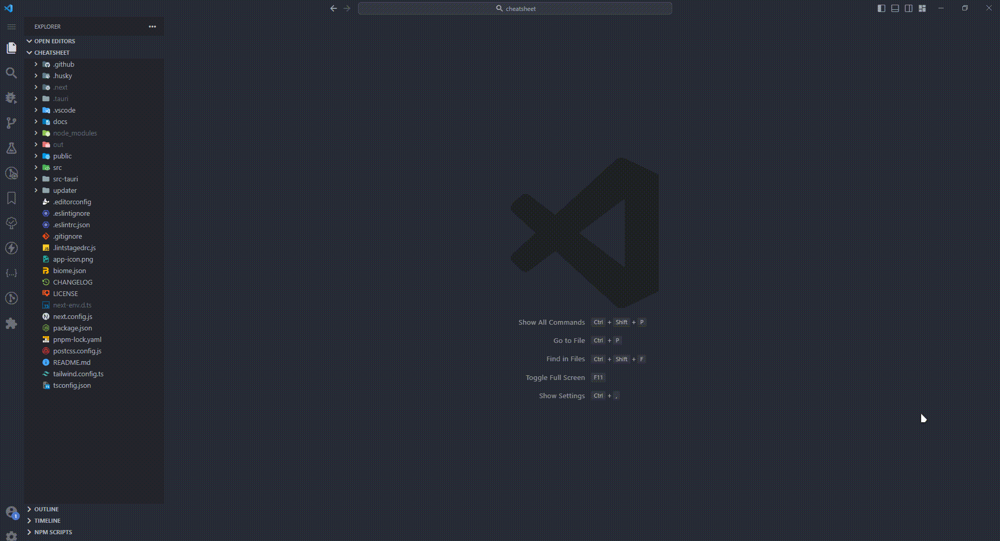

<div align="center">


### CheatSheet

<b>🎉 一个跨平台显示应用快捷键的软件</b>


<br/>


&nbsp

</div>

# 👋 目录

- [👋 目录](#-目录)
- [⚡️ 基本使用](#️-基本使用)
  - [全局热键](#全局热键)
  - [快捷键](#快捷键)
  - [快捷键描述](#快捷键描述)
- [🚀 配置窗口](#-配置窗口)
  - [CheatSheet 窗口样式](#cheatsheet-窗口样式)
  - [自定义全局热键](#自定义全局热键)
  - [配置的导入/导出](#配置的导入导出)
- [🎉 更新窗口](#-更新窗口)
  - [最新版](#最新版)
  - [更新版本](#更新版本)
- [✨ 安装](#-安装)
  - [Windows](#windows)
  - [Mac](#mac)
- [🤝 手动编译](#-手动编译)
  - [环境要求](#环境要求)
  - [开始编译](#开始编译)

# ⚡️ 基本使用

> 注意: 如果当前应用没用适配, 默认显示系统的快捷键

当处于某个应用下时, 按下全局热键, 即可显示当前应用的快捷键

<div align="center">
  
</div>

多个应用直接切换

<div align="center">
  
</div>

## 全局热键

通过全局热键(默认`F2`)打开 CheatSheet 快捷键窗口, 再次按下`F2`隐藏当前窗口。

## 快捷键

| 类型         | 描述                                                            | 样式                                               |
| ------------ | --------------------------------------------------------------- | -------------------------------------------------- |
| 普通快捷键   | 按顺序按下每一个按键即可                                        |       |
| 组合快捷键   | 先按下第一个普通快捷键,再按下第二个普通快捷键,用`&`符号表示     |  |
| 多功能快捷键 | 第一个普通快捷键和第二个普通快捷键都能触发该功能,用`\|`符号表示 |        |

## 快捷键描述

当快捷键描述超出一定长度时, 对于溢出的字符会进行省略, 可以通过将鼠标划入到该描述的方式来显示完整的描述。

<div align="center">
  
</div>

# 🚀 配置窗口

功能如下:

- 开机自启
- 检查更新
- CheatSheet 窗口样式
- 主题设置
- 自定义全局热键
- 配置的导入/导出

## CheatSheet 窗口样式

<div align="center">
  
</div>

## 自定义全局热键

可以根据自己的需求去调整应用的全局热键
热键的要求：

1. 单键的话, 只支持 `F1` ~ `F12`
2. 快捷键的话, 支持功能键(`Ctrl`、`Alt`、`Shift`) + 普通按键, 如 `Ctrl + P`, `Ctrl + Shift + T` 等等方式

<div align="center">
  
</div>

## 配置的导入/导出

> 配置文件导入后, 并不会立刻生效, 需要重启软件!!!

在 `关于应用` 里面找到 `导出配置` 按钮，进行配置导出

在 `关于应用` 里面找到 `导入配置` 按钮，进行配置导入

# 🎉 更新窗口

### 最新版

<div align="center">
  
</div>

### 更新版本

<div align="center">
  
</div>

<div align="center">
  
</div>

# ✨ 安装

|平台  &emsp;&emsp;&emsp;&emsp;&emsp;&emsp;&emsp;&emsp;&emsp;    | 下载       &emsp;&emsp;&emsp;&emsp;&emsp;&emsp;&emsp;&emsp;&emsp;                                                      |
| ------- | ---------------------------------------------------------------- |
| Windows | [点击下载](https://github.com/JinSooo/CheatSheet/releases/latest) |
| Mac     | [点击下载](https://github.com/JinSooo/CheatSheet/releases/latest) |

## Windows

1. 在 [Release](https://github.com/JinSooo/CheatSheet/releases/latest) 页面下载最新 `exe` 安装包。
2. 双击安装包进行安装。

## Mac

1. 从 [Release](https://github.com/JinSooo/CheatSheet/releases/latest) 页面下载最新的 `dmg` 安装包。（如果您使用的是 M1 芯片，请下载名为`cheatsheet_{version}_aarch64.dmg`的安装包，否则请下载名为`cheatsheet_{version}_x64.dmg`的安装包）
2. 双击下载的文件后将 CheatSheet 拖入 Applications 文件夹即可完成安装。

# 🤝 手动编译

## 环境要求

- Node.js >= 18.0.0
- pnpm >= 8.5.0
- Rust >= 1.60

## 开始编译

1. Clone 仓库

   ```bash
   git clone https://github.com/JinSooo/CheatSheet.git
   ```

2. 安装依赖

   ```bash
   cd CheatSheet
   pnpm install
   ```

3. 开发调试

   ```bash
   pnpm tauri dev # Run the app in development mode
   ```

4. 打包构建

   ```bash
   pnpm tauri build # Build into installation package
   ```
